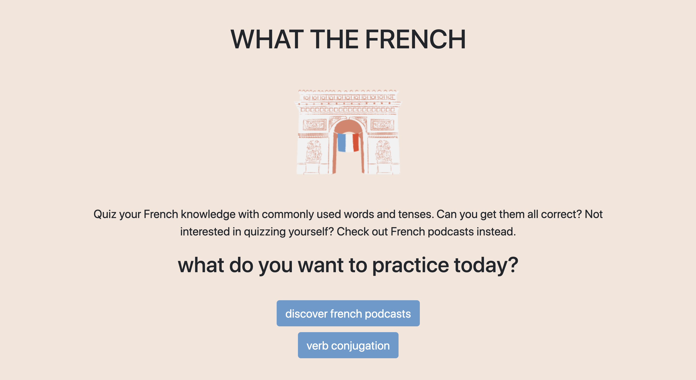
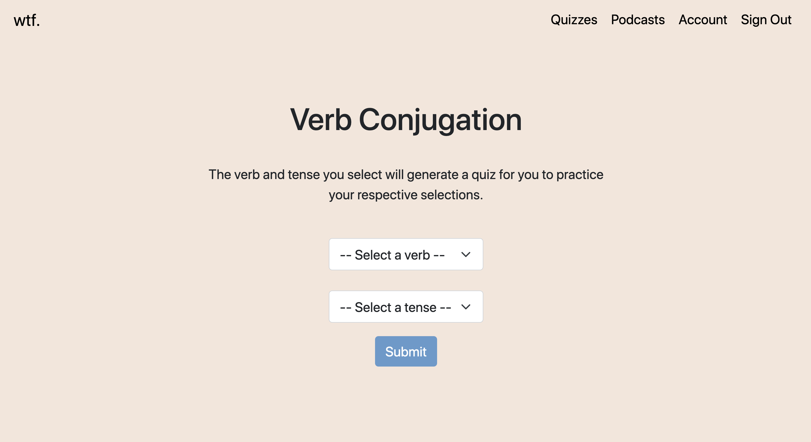
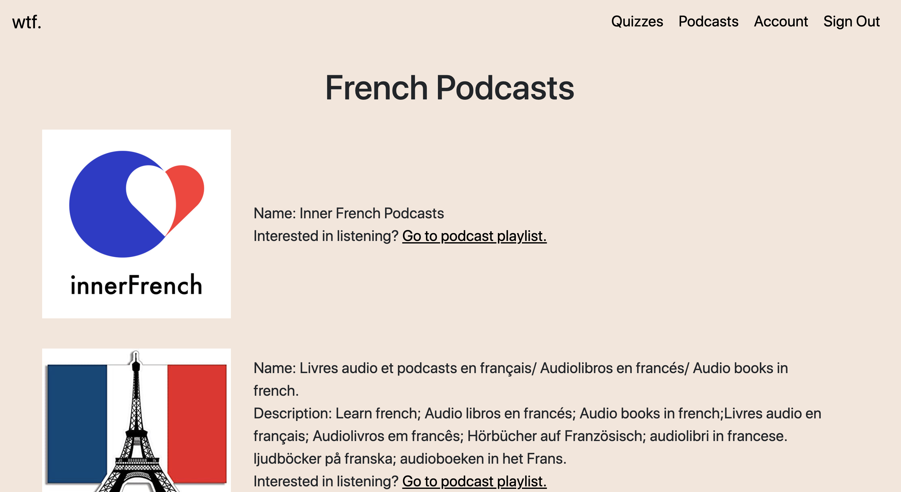

# What The French

An app built as a capstone project from my learnings from my bootcamp. Ultimately, a project for those who know a bit of French and are interested in quizzing themselves or want to listen to French podcasts.

## Motivation

Have you been practicing French for a while and just can't remember which verb and tense to use? Yeah, me neither. That's why I wanted to create What The French to help me practice and hopefully get 100% on one of the quizzes I created. If you're not interested in practicing your verb conjugation, you can listen to French podcasts instead.

## Technologies Used

- Python3
- Flask
- PostgresSQL
- SQLAlchemy
- JavaScript
- Jinja
- Bootstrap
- CSS

## How to use What The French

You can do two things on What The French: quiz yourself on verb conjugation and listen to french podcasts. In order to have access to the quiz section, you must create an account and login. Once you've taken a quiz, your scores will be listed in your Account section. Don't worry, you can take any given quiz as many times you'd like! If you are only interested in listening to podcasts, you don't need to create an account - you can start listening right away.

## Screenshots

Homepage


Verb Conjugation page


Podcast page


## How to run locally

```bash
$ git clone project
```

- cd into file path project was cloned to
- create a virutal env and activate it

```bash
$ pip3 install -r requirements.txt
```

- to run project with the following command

```bash
$ python3 server.py
```

## Spotify integration

In order to return results from Spotify's Search API, you will need your own client ID and secret.
You can find instructions on how to generate your own via this [link](https://developer.spotify.com/documentation/general/guides/app-settings/).

After you've generated your own ID and secret, you will need to create a config file to include them.
You should then be able to retreive results from Spotify.
